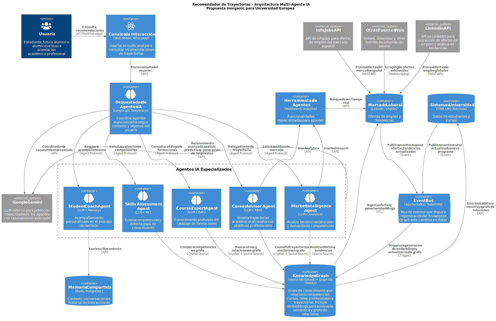
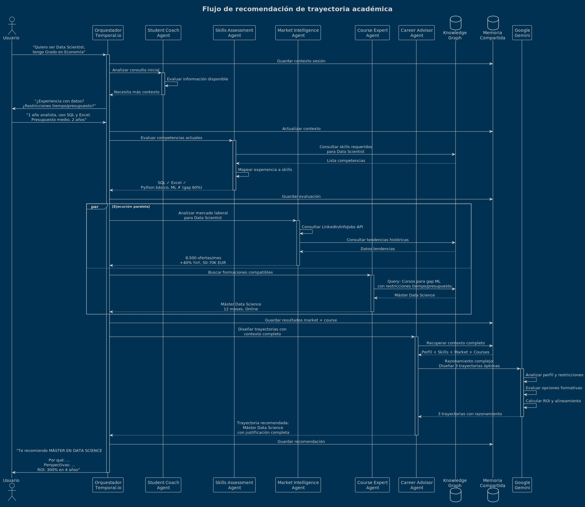

# Arquitectura multi-agente IA - Recomendador de trayectorias

---

## Resumen

Sistema inteligente basado en **agentes IA especializados** que colaboran para ofrecer recomendaciones personalizadas de trayectorias académico-profesionales a estudiantes, combinando:

- Análisis del perfil del estudiante y sus objetivos
- Inteligencia de mercado laboral en tiempo real (LinkedIn, InfoJobs)
- Conocimiento profundo del catálogo formativo de la Universidad
- Acompañamiento personalizado durante el proceso de decisión
- Razonamiento avanzado mediante Google Gemini

---

## Arquitectura del sistema

### Capas principales

El sistema se estructura en cinco capas que trabajan de forma coordinada. Desde la capa de presentación donde interactúan los usuarios, pasando por el orquestador que coordina la lógica de negocio, hasta las capas de datos que alimentan las decisiones de los agentes IA. Esta arquitectura modular permite escalar y evolucionar cada componente de manera independiente.

```
┌─────────────────────────────────────────────────────┐
│  Usuario (Web, Mobile, WhatsApp)                    │
└─────────────────────────────────────────────────────┘
                        ▼
┌─────────────────────────────────────────────────────┐
│  Orquestador de Agentes IA                          │
│  (LangGraph + Temporal.io)                          │
└─────────────────────────────────────────────────────┘
                        ▼
┌─────────────────────────────────────────────────────┐
│  5 Agentes IA Especializados + Google Gemini        │
└─────────────────────────────────────────────────────┘
                        ▼
┌─────────────────────────────────────────────────────┐
│  Knowledge Graph (Vector DB + Graph DB)             │
│  Herramientas | Memoria | Event Bus                 │
└─────────────────────────────────────────────────────┘
                        ▼
┌─────────────────────────────────────────────────────┐
│  Fuentes de Datos                                   │
│  Universidad | Mercado Laboral (LinkedIn/InfoJobs)  │
└─────────────────────────────────────────────────────┘
```

### Diagrama de arquitectura detallado

El siguiente diagrama muestra la arquitectura completa del sistema, incluyendo las interacciones entre componentes, los flujos de datos y las tecnologías utilizadas en cada capa:



---

## 1. Canales de interacción

Interfaces multicanal para que usuarios consulten recomendaciones desde cualquier dispositivo.

**Componentes**:
- **Web Application**: Portal principal con dashboards interactivos
- **Mobile App**: iOS/Android para acceso móvil
- **WhatsApp**: Canal conversacional para consultas rápidas

**Tecnología**: React + TypeScript (Web), React Native (Mobile)

---

## 2. Orquestador de agentes IA

El cerebro del sistema que coordina agentes especializados según el contexto del usuario.

**Responsabilidades**:
- Analizar consulta del usuario
- Seleccionar agentes apropiados
- Coordinar ejecución (secuencial o paralela)
- Agregar resultados de múltiples agentes
- Retornar respuesta unificada

**Patrones de orquestación**:

Sequential: `Usuario → Skills Assessment → Market Intelligence → Career Advisor → Respuesta`

Parallel: `Usuario → [Market Intelligence + Course Expert] → Agregación → Respuesta`

**Tecnología**: LangGraph / Temporal.io

---

## 3. Agentes IA especializados

### 3.1 Career Advisor Agent (asesor de carrera)

**Especialidad**: Diseño de trayectorias académicas personalizadas

**Capacidades**:
- Analiza perfil del estudiante (formación, experiencia, objetivos)
- Diseña trayectorias multi-nivel: Grado → Máster → Certificaciones
- Evalúa alineamiento con mercado laboral
- Calcula ROI de inversiones formativas
- Explica razonamiento de cada recomendación

**Ejemplo**:
> "Basándome en tu perfil (Grado en Economía + SQL), te recomiendo el Máster en Data Science. Demanda: MUY ALTA (+40% YoY). Salario: 50-70K EUR. ROI: 300% en 4 años."

---

### 3.2 Market Intelligence Agent (inteligencia de mercado)

**Especialidad**: Análisis del mercado laboral en tiempo real

**Capacidades**:
- Monitoriza ofertas de empleo (LinkedIn API, InfoJobs API)
- Identifica competencias más demandadas
- Analiza tendencias salariales por rol y ubicación
- Detecta sectores en crecimiento
- Predice necesidades futuras del mercado

**Fuentes de datos**: LinkedIn API, InfoJobs API, Web Scraping (Indeed, Glassdoor)

**Ejemplo**:
> "Cloud Architect: +40% demanda YoY | 3,500 ofertas/mes España | Salario 55-85K EUR | Top skills: Kubernetes, Terraform, AWS"

---

### 3.3 Course Expert Agent (experto en catálogo)

**Especialidad**: Conocimiento del catálogo formativo de la Universidad

**Capacidades**:
- Conoce todos los cursos, másteres y certificaciones
- Responde dudas sobre contenidos, modalidades, requisitos
- Sugiere formaciones complementarias
- Identifica prerequisitos y dependencias
- Explica competencias desarrolladas

**Ejemplo**:
> "Máster en IA: Enfoque técnico (Deep Learning, NLP). Duración: 12 meses. Modalidad: Online/Blended. Coste: 16,500 EUR (becas hasta 30%)."

---

### 3.4 Student Coach Agent (coach del estudiante)

**Especialidad**: Acompañamiento personalizado y empático

**Capacidades**:
- Guía conversacional personalizada
- Hace preguntas para clarificar objetivos y restricciones
- Ayuda a gestionar dudas y miedos
- Recuerda interacciones previas
- Adapta comunicación al perfil del estudiante

**Ejemplo**:
> "Entiendo tu preocupación sobre el coste. ¿Has explorado becas o programas part-time que te permitan trabajar mientras estudias?"

---

### 3.5 Skills Assessment Agent (evaluador de competencias)

**Especialidad**: Evaluación técnica de competencias

**Capacidades**:
- Evalúa competencias actuales del estudiante
- Identifica gaps respecto a roles objetivo
- Mapea experiencia laboral/académica a competencias
- Sugiere áreas de mejora prioritarias
- Valida nivel de dominio

**Ejemplo**:
```
Perfil actual:        Gap para Data Scientist:
✓ Python: Intermedio  ✗ Machine Learning
✓ SQL: Avanzado       ✗ Deep Learning
✓ Excel: Avanzado     ✗ Big Data (Spark)
```

---

## 4. Google Gemini (LLM externo)

Modelo de lenguaje que potencia las capacidades avanzadas de los agentes.

**Uso por agente**:
- **Career Advisor**: Razonamiento complejo para diseño de trayectorias
- **Market Intelligence**: Análisis predictivo de tendencias
- **Student Coach**: Respuestas empáticas contextualizadas
- **Skills Assessment**: Evaluación matizada de competencias
- **Course Expert**: Comprensión profunda de syllabi

**Ventajas**: Razonamiento avanzado multimodal, contexto largo (2M tokens), latencia baja, multilenguaje

**Estrategia híbrida**:
- Modelos locales: Tareas simples, privacidad crítica, alto volumen
- Gemini: Razonamiento complejo, decisiones críticas

---

## 5. Knowledge Graph (grafo de conocimiento)

Sistema híbrido: búsqueda semántica vectorial + relaciones estructuradas en grafo.

### Vector DB (Qdrant)
**Búsqueda por similitud semántica**

Contenido:
- Embeddings de cursos, competencias, ofertas de empleo
- Embeddings de trayectorias exitosas
- FAQs y documentación vectorizada

### Graph DB (Neo4j)
**Navegación por relaciones complejas**

Estructura:
```
(Student)-[:HAS_SKILL]->(Skill)
(Course)-[:TEACHES]->(Skill)
(Course)-[:LEADS_TO]->(Role)
(Role)-[:REQUIRES]->(Skill)
(Course)-[:PREREQUISITE]->(Course)
```

**Ventajas del enfoque híbrido**:
- Vector DB: "Cursos parecidos a..."
- Graph DB: "¿Qué necesito para llegar a X?"
- Combinados: "Cursos similares que cumplan prerequisitos"

---

## 6. Event Bus (arquitectura event-driven)

Sistema de mensajería asíncrono que dispara regeneración automática del Knowledge Graph.

**Flujo**:
```
LinkedIn API → Nuevas ofertas → Job Market DB
                    ↓
           PUBLICA EVENTO (Event Bus)
                    ↓
            Knowledge Graph
                    ↓
  Regenera embeddings + actualiza grafo
```

**Eventos**:
- `course.created`, `course.updated`: Cambios en catálogo
- `job_offers.new_batch`: Nuevas ofertas
- `skills.emerging`: Competencias emergentes

**Ventajas**: Desacoplamiento, tiempo real, escalabilidad, resiliencia

**Tecnología**: Apache Kafka o RabbitMQ

---

## 7. Herramientas de agentes

**Web Search Tool**: Información actualizada (Tavily API)
**Analytics Tool**: ROI, tendencias, métricas

---

## 8. Memoria compartida

**Redis** (sesiones): Contexto actual, variables temporales (TTL: 30-60 min)
**PostgreSQL** (historial): Recomendaciones, interacciones, feedback

**Usos**: Handoffs entre agentes, conversaciones multi-turno, insights compartidos

---

## Ejemplo completo: usuario quiere ser Data Scientist

```
1. Usuario (WhatsApp): "Quiero ser Data Scientist, tengo Grado en Economía"
   ↓
2. Student Coach: "¿Experiencia con datos? ¿Restricciones tiempo/presupuesto?"
   ↓
3. Usuario: "1 año analista, uso SQL y Excel. Presupuesto medio, 2 años"
   ↓
4. Skills Assessment evalúa: SQL ✓ Excel ✓ Python básico, ML ✗ (gap 60%)
   ↓
5. Paralelo:
   - Market Intelligence: 8,500 ofertas/mes, +40% YoY, 50-70K EUR
   - Course Expert: Encuentra "Máster Data Science" compatible
   ↓
6. Career Advisor (Gemini) diseña 3 trayectorias:
   - Conservadora: Bootcamp (6 meses)
   - Equilibrada: Máster (12 meses) ← RECOMENDADA
   - Ambiciosa: Máster + Especialización (18 meses)
   ↓
7. Respuesta:
   "Te recomiendo MÁSTER EN DATA SCIENCE

   Por qué:
   - Aprovecha tu base cuantitativa
   - Desarrolla Python, ML, Big Data
   - Modalidad Online

   Perspectivas:
   - Demanda: MUY ALTA (8,500 ofertas/mes, +40% YoY)
   - Salario: 50-60K EUR inicial, 70-90K EUR con experiencia
   - ROI: 300% en 4 años

   Inversión: 15,000 EUR (becas hasta 30%)
   Duración: 12 meses

   ¿Te ayudo con la beca?"
```

### Diagrama de secuencia

El siguiente diagrama muestra el flujo de ejecución del orquestador Temporal.io coordinando los diferentes agentes especializados:


